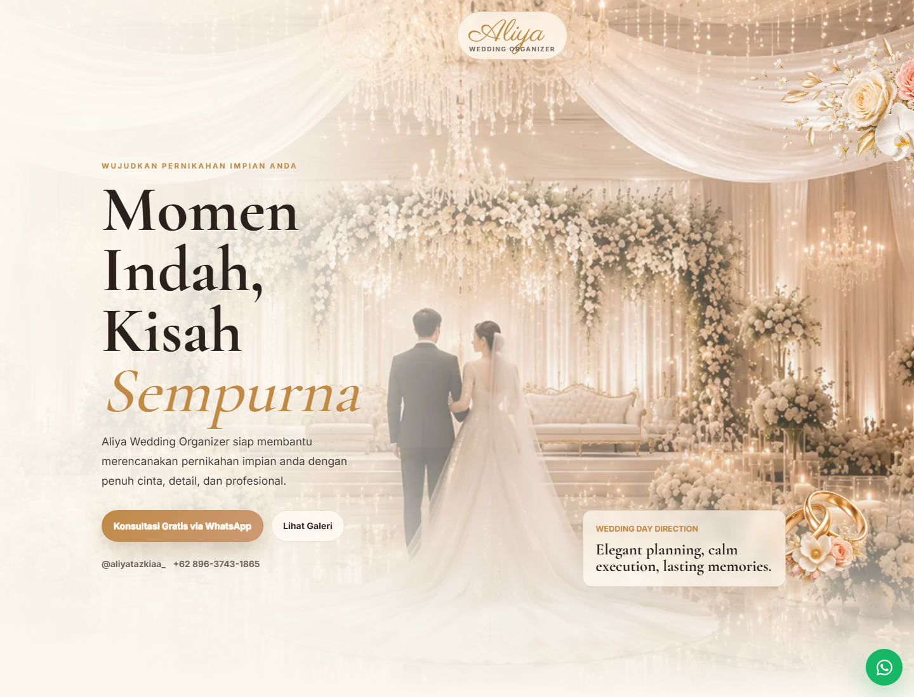
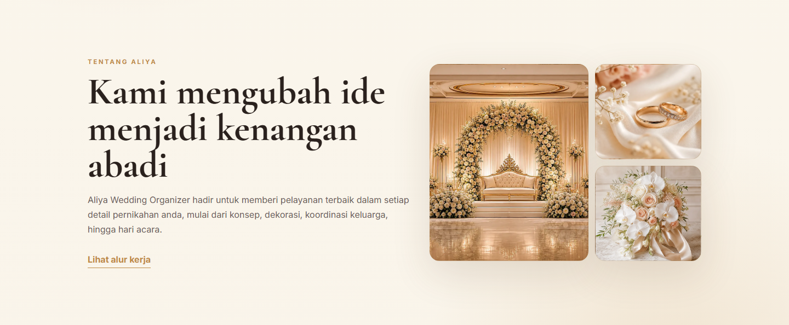
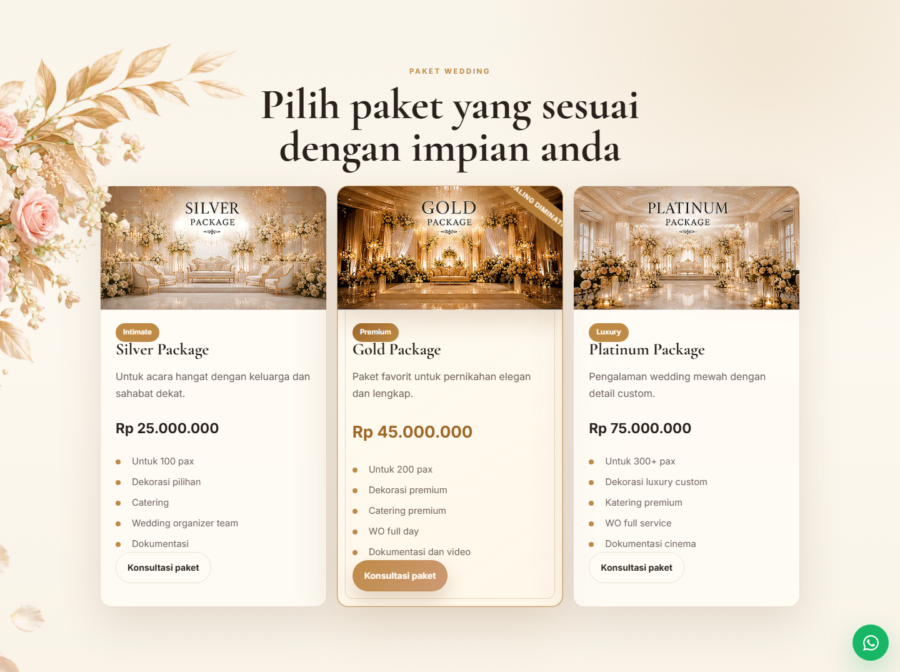
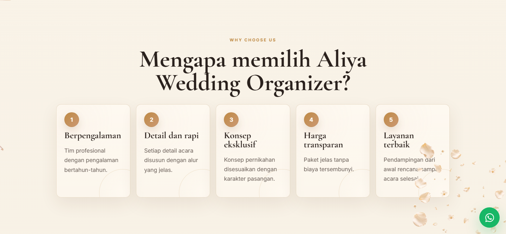
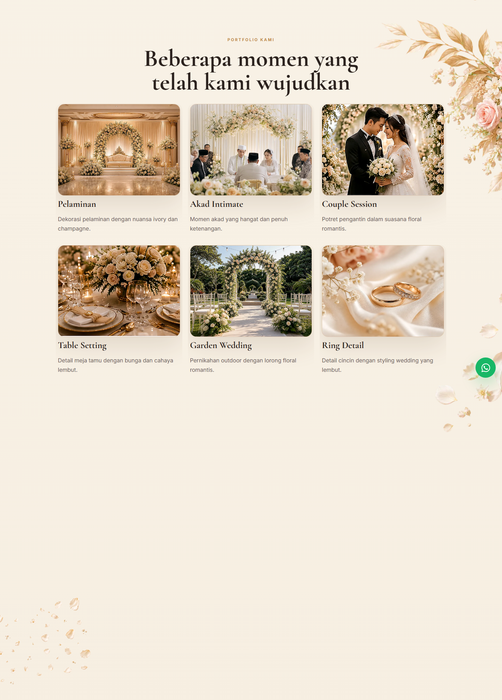
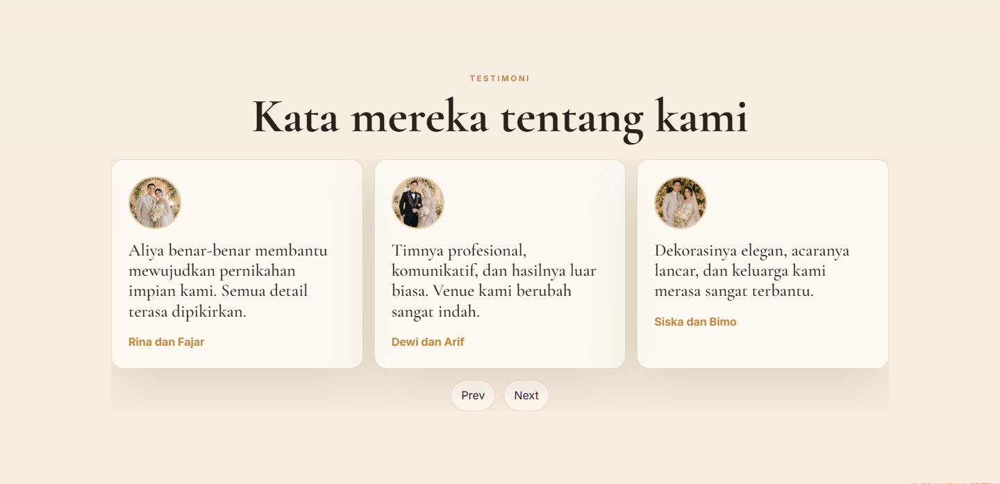
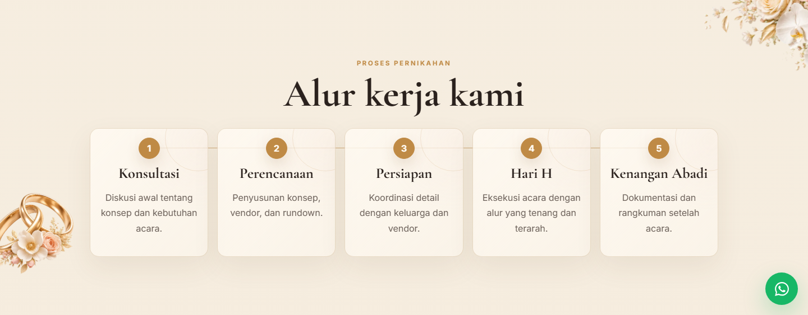
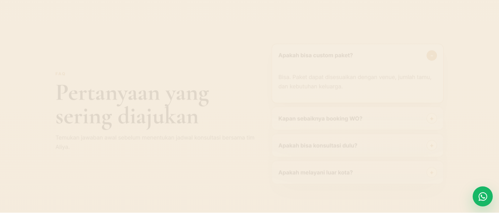
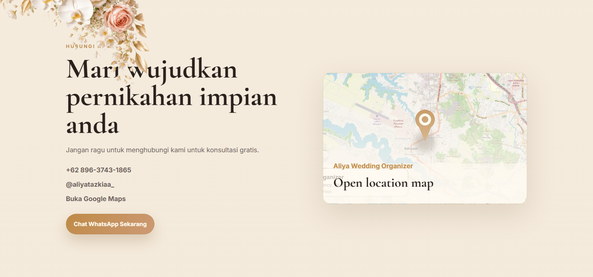

# Aliya Wedding Organizer

Website statis premium untuk Aliya Wedding Organizer. Halaman ini dibuat sebagai landing page wedding organizer dengan nuansa elegan, visual romantis, animasi scroll, preview galeri, FAQ accordion, testimonial slider, dan tombol WhatsApp mengambang.

## Preview

Jalankan lokal:

```bash
./start.sh
```

Buka:

```text
http://127.0.0.1:8000
```

Jika port `8000` sedang dipakai, jalankan alternatif:

```bash
python -m http.server 8765
```

Lalu buka:

```text
http://127.0.0.1:8765/index.html
```

## Section Website

Website ini terdiri dari section berikut:

1. Hero
2. Tentang Aliya
3. Paket Wedding
4. Why Choose Us
5. Portfolio Kami
6. Testimoni
7. Proses Pernikahan
8. FAQ
9. Hubungi Kami
10. Footer

## Screenshot dan Penjelasan Per Section

### 1. Hero



Section pembuka yang langsung memperkenalkan Aliya Wedding Organizer sebagai layanan wedding organizer premium. Area ini menampilkan headline utama, deskripsi layanan, tombol konsultasi WhatsApp, tombol menuju galeri, kontak singkat, serta visual hero yang membangun kesan romantis dan elegan.

### 2. Tentang Aliya



Section ini menjelaskan peran Aliya Wedding Organizer dalam membantu calon pengantin dari tahap konsep sampai hari acara. Layout split dengan kolase foto memberi konteks visual bahwa layanan berfokus pada detail, suasana, dan kenangan pernikahan.

### 3. Paket Wedding



Section paket menampilkan pilihan layanan wedding yang bisa disesuaikan dengan kebutuhan calon klien. Setiap kartu paket memudahkan pengunjung membandingkan opsi layanan sebelum menghubungi tim untuk konsultasi.

### 4. Why Choose Us



Section ini menjelaskan alasan memilih Aliya Wedding Organizer. Kontennya disusun dalam grid ikon agar keunggulan layanan mudah dipindai, seperti perencanaan rapi, eksekusi tenang, dan perhatian pada detail acara.

### 5. Portfolio Kami



Section portfolio menampilkan galeri momen pernikahan yang sudah dikerjakan. Pengunjung dapat melihat nuansa visual layanan dan mendapatkan gambaran gaya dekorasi, suasana acara, serta kualitas dokumentasi.

### 6. Testimoni



Section testimoni berisi ulasan dari klien. Slider testimoni membantu membangun kepercayaan melalui pengalaman nyata pengguna layanan Aliya Wedding Organizer.

### 7. Proses Pernikahan



Section proses menjelaskan alur kerja dari konsultasi awal sampai pelaksanaan acara. Timeline ini membantu calon klien memahami tahapan kerja tim secara ringkas dan terstruktur.

### 8. FAQ



Section FAQ berisi pertanyaan yang sering diajukan sebelum konsultasi. Accordion membuat informasi tetap ringkas, tetapi detail jawaban tetap mudah dibuka ketika dibutuhkan.

### 9. Hubungi Kami



Section kontak menjadi titik konversi utama. Pengunjung dapat langsung menghubungi lewat WhatsApp, membuka Instagram, menelepon, atau melihat lokasi melalui Google Maps.

### 10. Footer


Footer menutup halaman dengan identitas brand Aliya Wedding Organizer dan informasi copyright. Bagian ini menjaga akhir halaman tetap bersih dan konsisten dengan gaya visual website.

## Fitur Utama

- Layout responsive mobile-first.
- Visual mode: Luxury, Cinema, dan Booking.
- Scroll reveal animation dan parallax.
- Gallery preview modal.
- FAQ accordion.
- Testimonial slider.
- Sticky WhatsApp contact.
- Konten mudah diedit lewat `src/data/site.js`.

## Struktur Project

```text
assets/
  images/
  videos/
  music/
  overlays/
  compressed/
docs/
  screenshots/
src/
  css/styles.css
  js/app.js
  data/site.js
tools/
  compress_assets.py
index.html
server.py
start.sh
stop.sh
vercel.json
```

## Edit Konten

Sebagian besar konten dinamis berada di:

```text
src/data/site.js
```

File tersebut dapat digunakan untuk memperbarui paket, galeri, testimoni, alur proses, FAQ, tautan WhatsApp, Instagram, dan Google Maps.

## Compress Assets

Letakkan media original di folder `assets/`, lalu jalankan:

```bash
python tools/compress_assets.py
```

Untuk konversi gambar ke WebP, install Pillow:

```bash
python -m pip install pillow
```

Untuk video dan musik, install `ffmpeg`. Helper akan menampilkan command kompresi yang aman.

## Deploy

Website ini adalah static site dan dapat dideploy ke Vercel, Netlify, GitHub Pages, atau VPS static server.
